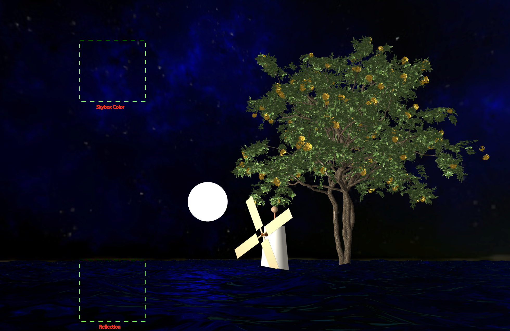

# RT_Rendering_Lab4
A Scene with a Hierarchical (6 hierarchy) Windmill, Trees (third party mesh downloaded from https://sketchfab.com/3d-models/huaranhuay-357ae26a13a540f6889c8fdf5382045e) and periodic sea inspired by https://www.shadertoy.com/view/MdXyzX.

## Features

1. Reflection on sea water.

2. Self Animation (the windmill blade).
3. Point Light (the white sphere).
4. Texture mapping (see the tree).

## Usage

Launch a server (for loading the mesh) and open the index.html to launch.

1. `w`, `a`, `s`, `d` for moving the windmill `forward`, `left`, `backward`, `right`.

2. `⬆️`, `⬅️`, `⬇️`, `➡️` for moving the camera `forward`, `left`, `backward`, `right`.

3. `P/p`, `Y/y`, `R/r` for `increasing/decreasing` the pitch, yaw and roll angle. 

4. `h` for toggle whether showing hierarchy or not (hierarchy is rendered as wireframe of bounding boxes, use same color for components of same depth).

5. `C/c`, `V/v`, `B/b` for increasing/decreasing the `x`, `y`, `z` compoment of light position (there is a white ball to represent the light).

## Software Info
Operating system: MacOS

Web browser: Safari